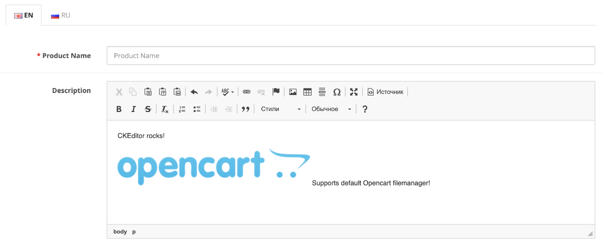

# FOC: CKEditor instead of Summer

Simple module for Opencart 3.x to replace default wysiwyg editor known as `Summernote` with `CKEditor`



### Installation

1. Download [ready to install OCMod]()
1. Install it with default `Extension installer`
1. Update modifications in `Extensions/Modifications`

### Replace builtin CKEditor

By default module ships CKEditor 4.14.0 with `Standard` toolbar and Russian/English only translations.

You can build your own with [CKEditor build tool](https://ckeditor.com/cke4/builder). To change ckeditor, just replace all files in `upload/admin/view/javascript/ckeditor/*` with new ones you got from build tool.

Then build OCMod with `pack.sh` bash script:

```sh
bash pack.sh
```

Script produces `foc_ckeditor_insteadof_summer.ocmod.zip` which you can install with default Opencart extensions installer.

Also you can make ZIP by a hand (your archive must contain `install.xml` and `upload` in root). If you do so, please, do not forget to add `*.ocmod.zip` extension before you install.
